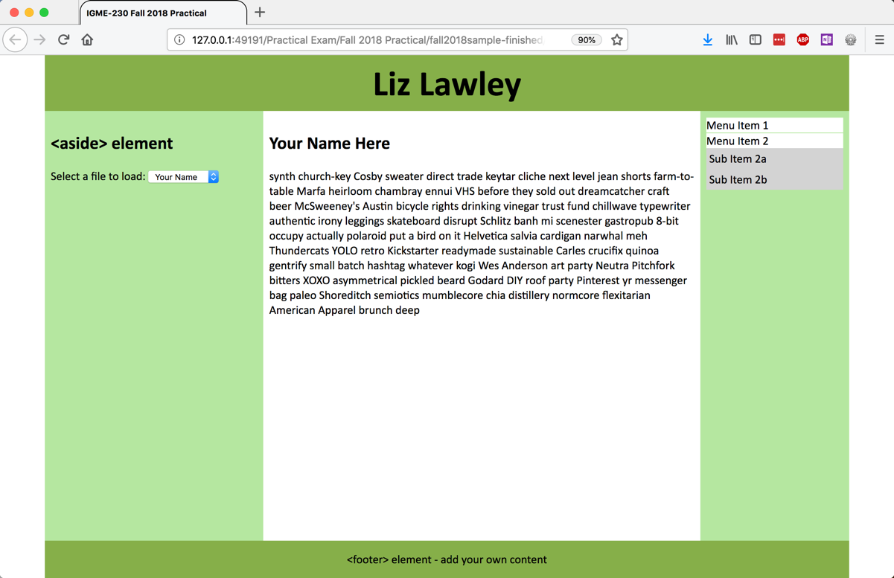
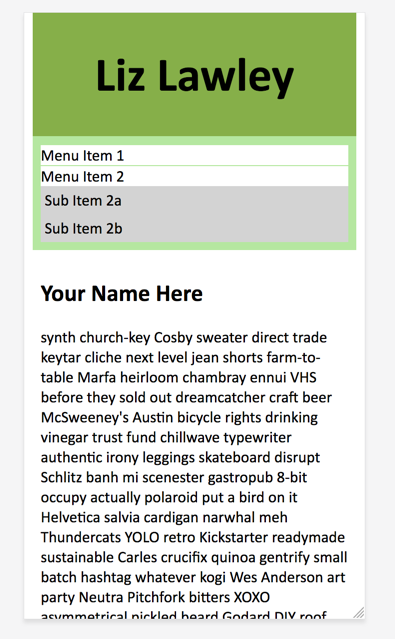

# Sample Practical

| [Jump to Screenshots](#finished-version) | [Jump to Grading](#grading) |
|-----|-----|

This sample practical includes all the basic concepts that the final practical will include: CSS formatting, CSS layout, responsive design, and JavaScript functionality. The final practical will vary in its constraints/implementation. (For instance, you might be asked to build a grid with a column spanning multiple rows instead of, or in addition to, a row spanning multiple columns. Or you might need to trigger a JavaScript event based on a mouse click rather than a menu change.) 

Once you've worked through this sample practical, it is my expectation that you will be able to complete the final practical during our allotted class time on 12/6 (75 minutes). 

On the final practical, you must get 7/10 points to pass. If you do not, you will need to take the exam again on during our scheduled final exam time (Wednesday, December 13 from 10:45am to 1:15pm). You must receive an 8/10 to pass that exam. If you do not pass either exam, you will not receive a passing grade in the class.  

*Important Note for Students Who Need Extended Testing Time:* If you require extended testing time, you should not attend class on Wednesday, December 6th. You will instead take the exam during our scheduled final exam time, which will provide double the time allotted in class. If do not get 7/10 points on that practical, I will work with you to find a time for you to take a second version under my supervision during exam week. (Or, if necessary, give you an incomplete for the class and have you take the final practical at the start of the spring semester.)

## Instructions

Begin by downloading [fall2018sample.zip](fall2018sample.zip), which contains the .html, .css and .js files for this project. Do *not* edit the .html file -- all of your work should be in the .css and .js files.  

**Mobile Grid Layout (2 points)**
- Grid takes up 100% of viewport width
- One column that uses all horizontal space
- Rows automatically generated
- Row order of elements: 1-header, 2-nav, 3-article, 4-aside, 5-footer

**Desktop Grid Layout (2 points)**
- Grid width is 90% of the viewport width, with a max-width of 1200px
- Grid min-height is 100% of the viewport height
- Grid has three rows and three columns
- First row is 4rem high, spans all columns, and holds <header>
- Second row uses all available vertical space, and holds three elements:
    - First column takes up 1/3 of available width and holds <aside> element
    - Second column takes up 2/3 of available width and holds <article> element
    - Third column has a width of 200px and holds <nav> element
- Third row is 3rem high, spans all columns, and  holds <footer>

**CSS Formatting (2 points)**
- Header and footer use flexbox for horizontal and vertical centering of content
- Menu items have white bg, no margins, 1px solid top border the same color as <nav> background.
- Submenus have no bullets, margins, or padding, and are hidden on load
- Submenu list items have left padding of .25rem and a light gray background

**JavaScript Content Load Menu (2 points)**
- Submenus hidden on load. Clicking on a menu shows/hides associated submenu
- jQuery used to slide the menu up and down when showing/hiding

**JavaScript AJAX Content Loading (2 points)**
- Edit content1.txt to use your name and today’s date. It should be displayed in the #contents element by default when the page loads
- Selecting a menu item should display the appropriate content file

---

| [Return to Instructions](#instructions) | [Jump to Grading](#grading) |
|-----|-----|

## Finished Version
Here's what the finished site should look like:

 
---

| [Return to Instructions](#instructions) |
| --- |

## Grading

Each bulleted item is worth 1 point. You need 7/10 points to pass the exam. 

Desktop Grid
- Grid layout correct (rows & columns)
- Content elements properly placed
	
CSS formatting
- Header/footer flex formatting
- Menu formatting
	
Mobile Grid
- Grid Layout
- Content ordering
	
Nav Menus
- Shows/hides appropriate submenu on click
- Uses jQuery to slide submenus up and down
	
Aside (content) Menu
- content1.txt loads by default
- Menu options load content files properly
	
| [Return to Instructions](#instructions) |
| --- |
