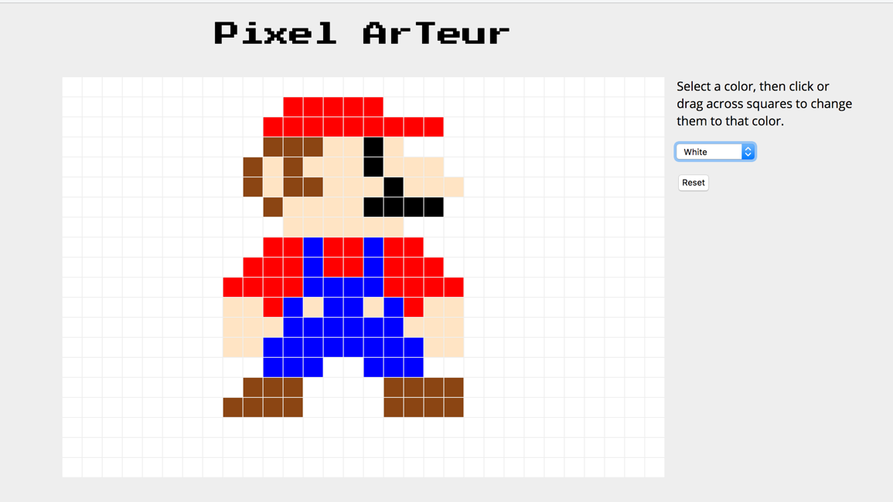
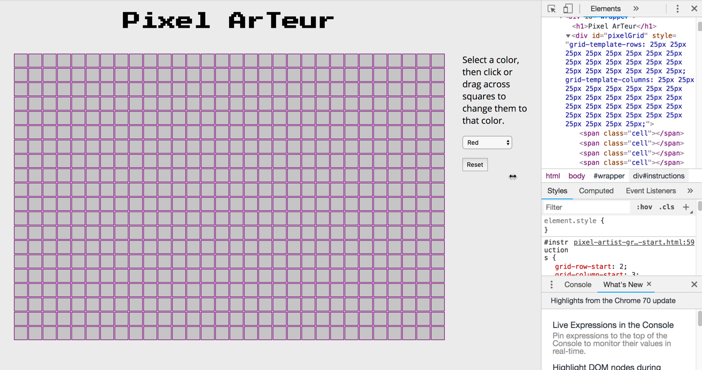
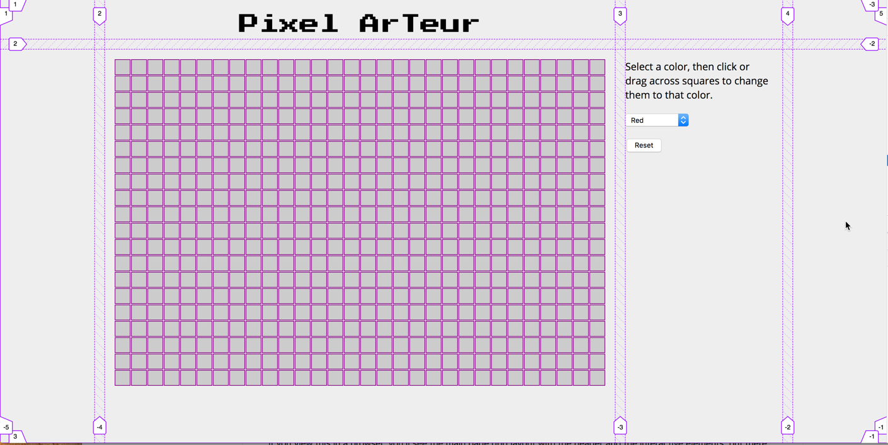

# "Pixel Artist" Web Application Exercise

## Overview
- In this assignment you will create a simple pixel art application. The user will be able to click or drag in a grid, which will then fill with whatever color they have chosen in the HTML `<select>` on the right.
- The pixel grid is comprised of `<span>` tags that have been created and added to the grid using JavaScript and jQuery.
- When a cell is clicked on, we change the color of that cell to match the currently selected color. If the user holds down the mouse button, any cells that the mouse moves over are also changed. 
- This exercise could possibly be extended into your final project, or into a personal portfolio piece:
    - The features and polish of the application could be extended and improved. For example, create clickable color swatches rather than a pull down menu, the ability to save creations locally in the user's browser via `localStorage`, and so on.
    - Or, now that you have a working grid, you could create an entirely different kind of experience--for example a tile-based board game like Minesweeper or Othello.
    




## Getting Started

Here is your starting file with the HTML and CSS all done for you. Copy and paste the code into a new HTML document and save it with the name **pixel-artist.html**

#### pixel-artist.html

```html
<!DOCTYPE html>
<html lang="en">

<head>
    <meta charset="utf-8" />
    <title>Pixel Arteur Grid / jQuery</title>
    <link href="https://fonts.googleapis.com/css?family=Press+Start+2P" rel="stylesheet">
    <link href="https://fonts.googleapis.com/css?family=Open+Sans" rel="stylesheet">
    <script src="https://ajax.googleapis.com/ajax/libs/jquery/3.3.1/jquery.min.js"></script>

    <style>
        * {
            box-sizing: border-box;
        }

        html,
        body {
            margin: 0;
            padding: 0;
            font-family: "Open Sans", Helvetica, Arial, sans-serif;
        }

        #wrapper {
            min-height: 100vh;
            display: grid;
            grid-template-rows: 4rem auto;
            grid-template-columns: 1fr auto 250px 1fr;
            grid-gap: 1em;
            background-color: #eee;
        }

        h1 {
            grid-column-start: 2;
            font-family: 'Press Start 2P', cursive;
            font-size: 2rem;
            justify-self: center;
        }

        #pixelGrid {
            grid-row-start: 2;
            grid-column-start: 2;
            display: grid;
            grid-gap: 1px;
            justify-self: center;
            margin: 1em;
            background-color: #eee;
        }

        span.cell {
            border: 1px solid purple;
            background-color: #ccc;
            padding: 0;
            margin: 0;
        }

        span.cellSelected {
            border: none;
        }

        #instructions {
            grid-row-start: 2;
            grid-column-start: 3;
            padding-right: 1em;
            justify-self: left;
            max-width: 20rem;;
        }

        #colorChooser {
            height: 1.5rem;
            margin: 0; 
            padding: 0;
        }

        #reset {
            height: 1.5rem;
            display: block;
            margin: 1rem 0;
            padding: 0;

            
        }
    </style>
</head>

<body>
    <div id="wrapper">
        <h1>Pixel ArTeur</h1>
        <div id="pixelGrid"></div>

        <div id="instructions">
            <p>Select a color, then click or drag across squares to change them to that color.</p>
            <select id="colorChooser">
                <option value="aqua">Aqua</option>
                <option value="bisque">Bisque</option>
                <option value="black">Black</option>
                <option value="blue">Blue</option>
                <option value="saddlebrown">Brown</option>
                <option value="green">Dark Green</option>
                <option value="lawngreen">Bright Green</option>
                <option value="magenta">Magenta</option>
                <option value="orange">Orange</option>
                <option value="pink">Pink</option>
                <option value="red" selected>Red</option>
                <option value="white">White</option>
                <option value="yellow">Yellow</option>
            </select>
            <button id="reset">Reset</button>
        </div>
    </div>
    <script>
     


    </script>
</body>

</html>

```

If you view this in a browser, you'll see the main page grid layout with the header and the interactive elements, but there won't be a pixel grid--we're going to generate that using code. 


## Define and Create the Grid

1. To get our grid of "pixels" set up and visible, we need to define the number of rows and columns for the pixel grid, as well as the size (in actual pixels) of the individual cells. 
    - `const numCols = 30; // specify pixel grid columns`
    - `const numRows = 20; // specify pixel grid rows`
    - `const cellSize = 25; // specify dimension of cell square in px`
    - `const numCells = numCols * numRows; // calculate total number of cells`

    We can change any of those numbers later to create a differently-sized grid. 

1. Using those constants, we can use JavaScript to set the number of rows and columns for the pixel grid, and the size of those rows and columns. We've defined those values as constants already, so we don't want to hard code them into our CSS or our Javascript. 

2. Create a variable for the #pixelGrid div, (`let pixelgrid = document.querySelector("#pixelGrid");`, and then use the JavaScript method `element.style.property` to set its `grid-template-rows property` to the number of rows, and its `grid-template-columns` property to the number of columns. Since all the rows and columns are the same width, you can use the `repeat(#,size)` syntax. If we were hard coding this into the CSS,it would look like this:
```css
grid-template-columns: repeat(30,25px);
grid template-rows: repeat(20,25px); 
```

Since you've got the number of rows, the number of columns, and the size of the cells as constants, you'll need to create that value string by concatenating text and variables. I highly recomment using ES6 templating strings for this rather than standard concatenation (you can see both examples below; don't use both, and don't forget that you need one for the rows, as well!)
```javascript
pixelgrid.style.gridTemplateColumns = "repeat(" + numCols + "," + cellSize + "px)";  // standard concatenation
pixelgrid.style.gridTemplateColumns = `repeat(${numCols},${cellSize}px)`;            // ES6 template string
```

1. Now we want to create enough cells to fill the grid that we just defined. To create a single element with the correct class and add it to the grid, we can use this jQuery line: 

```javascript
    $("#pixelGrid").append('<span class="cell"></span>');
```

We'll use a for loop to create all the cells we need--to do that, you'll need to know the number of cells (hint: we defined it as a constant!).

If you did this this properly, you should now have a pixel grid that looks like this: 




## Implement a Click Event

Clicking on a cell should turn it to the selected color - let's get that working now.

1. Define a script-level variable of `color` that will hold the currently selected color. jQuery makes it easy to retrieve the current value of a select element with `$( "selector" ).val();` (Replace "selector" with a selector for the menu element on the page.)

2. We also want to make sure the color changes when the user chooses a new one from the list. That means we need a script level variable for color, and an event listener for the menu that changes the color value. We could set the color to a default value, but then we'd need to change if it we decided to change the available colors in the menu (or the default selected option). Instead, we'll use jQuery to retrieve the the value of the currently selected menu option. As you can see, this is a *lot* easier than what we had to do with native JavaScript to find the currently selected color in the Events exercise! (Make sure you check the console when you reload the page to make sure that the selected color was logged!)

```javascript
let color = $("putmenuselectorhere").val();
console.log(color);
```

3. jQuery also makes it easy to add an event listenter that changes the color value when the user selects a new item from teh menu. Use the code below (but make sure you replace "selector" with the actual selector for the menu! Notice that the code uses the `this` keyword, since we're getting the value from the selector that triggered the event. (Test your code by picking a new color and seeing if it's properly logged to the console.)

```javascript
$("putmenuselectorhere").change(function () { 
    color = $(this).val();  
    console.log(color);  
});
```

4. Now that we've got the color, we can create a new event handler that changes the color of a cell when it's clicked. Again, jQuery makes this easier than native JavaScript. We're going ot use the same construction that we did in the previous step, but this time we're going to use the `.click` method instead of the `.change` method. We want to attach that to all of the items that have a class of `.cell`, and use it to change the background color of the clicked cell to the current color value. Because jQuery automatically applies the method to all elements that match the query selector, we don't need to write a loop. (Again, remember to change the generic selector string!)

```javascript
$("selector").click(function () { 
    $(this).css("background-color", color);
});
```

4. Test it out now. Does it work? If so, **congratulations**! You now have the MVP (Minimum Viable Product) version of your app. To get credit for this exercise, this is the minimum level you need to accomplish. However, the finished product is a lot more impressive--and you'll learn a lot more about JavaScript and jQuery, if you continue on and add in the drag behavior!

## Adding Drag Behavior
Right now we can click on individual cells to change their color, but it would be so much better if we could click and then drag the mouse to "paint" multiple pixels. Let's make that happen.

For this portion of the exercise, we'll work with three new jQuery event methods--mousedown, mouseover, and mouseup. 

1. When the mouse button goes down, we want it to fill the cell that it's on, as well as any that it passes over until the mouse button goes back up. We'll start by replacing the previous click event handler with a mousedown event handler:

```javascript
$("selector").mousedown(function () { 
    $(this).css("background-color", color);
});
```

2. Inside that function, we need to call another event handler for mouseover--it will change the color of every cell the mouse passes over after the button is pressed. In this case, the first "this" refers to the cell that the user first clicked on, and the second "this" refers to each cell that the mouse passes over. 

```javascript
$("selector").mousedown(function () { 
    $(this).css("background-color", color);
    $("selector").mouseover(function () {
        $(this).css("background-color", color);
    });
});
```

3. Test it and see if it works. If you got the code right, the dragging will in fact work. But, unfortunately, the mouseover behavior continues even after you release the mouse button. We have to unbind the mouseover event from the cells to make that stop. jQuery allows us to do that with the `.unbind()` method:

```javascript
$("selector").unbind("event");
```

4. We need to call the unbind method no matter where on the page the the mouse button is lifted, so that if someone drags off the edge of the grid and then releases the button it still unbinds the event. To bind an event handler to everything on the page, we use the document object. This time, instead of using the `this` keyword, we have to specify that the unbind method be used on the selector that has the mouseover event attached to it. 

```javascript
$(document).mouseup(function () {
    $("selector").unbind("mouseover");
});
```
5. Once you have the page working, play around with it a bit. It's likely that at some point, you'll find that instead of changing the cell color, the browser tries to handle the drag behavior "normally"--by selecting part of the document. This also causes problems with the mouseup behavior being properly detected. To fix this, we have to use JavaScript's `preventDefault` method to stop the default behavior of a `mousedown`. You'll need to add this line to the beginning of the .mousedown function: 

```javascript
event.preventDefault(); 
```

**Reload the page and try it out. You should now be able to click and drag to paint multiple cells.**


## The Reset Button

If you want to wipe out your image and something new, you could reload the page--but that's never an ideal UX case. Instead, we'll add a button that resets all the cells to their default state. 

The HTML page already has the button in place for you. You just have to bind an event handler to it that resets the background color of all the cells to the initial value. 

See if you can figure out what the jQuery line would be to change the background color for all of the cells. (The syntax you need is available in the code you've already written...)

(If you wanted to, you could add another button that automatically set all the cells to a different background color, using the same basic code.)


## The Responsive Page (Optional Explanation for Layout Geeks)

You may have noticed that there are two grids defined on this page; one is for the pixels, and the other is for the overall page layout (#wrapper). 

The #wrapper element is set up to take up the full height of the viewport, so that the background color covers the entire viewable space. It's also a 2x4 grid container. The first row has content only in the second column (the title); the other three cells are empty. The second row has the pixel grid in the second column, and the instructions and controls in the third column; the first and fourth columns are empty. 

I implemented a 4-column grid because I'm using the first and fourth columns to center the rest of the content in the viewport. The second column is set to auto, so it should take up only as much space as the #pixelGrid container requires. The #instructions container is set to 250px. The other two columns are each set to 1fr, which means they each take up an equal amount of the remaining space--functioning like `margin: 0 auto` but in a more semantic and reliable way. The #instructions element is set to justify-self: left, which keeps it adjacent to the side of the pixel grid, regardless of the size of the viewport. The h1 element is set to justify-self:center so that it stays centered over the grid. 




Try changing the constant values in the script to create a grid of a different size (you can change the number rows, the number of columns, and or the size of the cells). How does the layout hold up as you resize the grid and/or the viewport? 


## Deliverable
Upload your completed pixel-artist.html file (responsive grid optional) to your igme230 folder and link to it from your main class page as "Week 12: Pixel Artist Exercise". Because we're working throught most of this in class, I expect you to have it turned in no later than the beginning of Thursday's class. 


